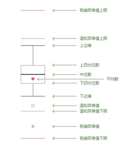

**数据探索与准备步骤**

 主题

- 箱型图 

  - 一四分位 将数据根据从小到大的顺序进行排列 排在25%位置的书叫做第一四分位 
  - 一四分位 二四分位 三四分位 
  - 描述偏态数据的离散程度 
  - IQR为四分位距离
  - 箱形图可以很直观的分析数据的离散分布情况，上四分位数与下四分位数的距离越小说明越集中，否则说明越分散，对于上下边缘来说是一样的。然后通过中位数偏向于上四分位数还是下四分位数可以来分析数据分布的偏向。箱形图还有一个优点是相对受异常值的影响比较小，能够准确稳定地描绘出数据的离散分布情况，会比较有利于数据的清洗。
  - 上限=（Q3+1.5IQR，max)取最小
  - 下限=（Q1-1.5IQR ，min)取最大

- 箱型图的优点有：

  - 直观明了地识别数据批中的异常值
  - 利用箱线图判断数据批的偏态和尾重

- 箱型图的局限有：

  - 不能精确地衡量数据分布的偏态和尾重程度；对于批量比较大的数据，反映的信息更加模糊以及用中位数代表总体评价水平有一定的局限性

  - 极端异常值，即超出四分位数差3倍距离的异常值，用实心点表示；较为温和的异常值，即处于1.5倍-3倍四分位数差之间的异常值，用空心点表示。

    

- 小提琴图 (Violin Plot)

  - 用来展示多组数据的分布状态以及概率密度。
  - 这种图表结合了箱形图和密度图的特征，主要用来显示数据的分布形状。

  - 跟箱形图类似，但是在密度层面展示更好。
  - 在数据量非常大不方便一个一个展示的时候小提琴图特别适用。




-  获取节假日的数据
- The QingMing festerval (April.5 - April.7)
- The Labour day (May.1 - May.5)
- The DuanWu festeval (May.31 - June.2)
- The MidAutumn festeval (Sep.6 - Sep.8)
-  Mother day(May.13)
- Father day(June. 17)
- TianMao 618 sales(June 10 - June 20)
- Teachers' day(Sep 9)

```python
	qingming = total_balance[(total_balance['date'] >= datetime.date(2014,4,5)) & (total_balance['date'] < datetime.date(2014,4,8))]
	labour = total_balance[(total_balance['date'] >= datetime.date(2014,5,1)) & (total_balance['date'] < datetime.date(2014,5,4))]
	duanwu = total_balance[(total_balance['date'] >= datetime.date(2014,5,31)) & (total_balance['date'] < datetime.date(2014,6,3))]
	data618 = total_balance[(total_balance['date'] >= datetime.date(2014,6,10)) & (total_balance['date'] < datetime.date(2014,6,20))]'''
```
```python
import pandas as  pd
import numpy as np
import warnings 
import datetime
import seaborn as sns
import matplotlib.pyplot as plt
import datetime 
from scipy import stats
import warnings
warnings.filterwarnings('ignore')
```
```python
# 读取数据
data_balance = pd.read_csv(**.csv')
```

```python
# 为数据集添加时间戳
data_balance['date'] = pd.to_datetime(data_balance['report_date'], format= "%Y%m%d")
data_balance['day'] = data_balance['date'].dt.day
data_balance['month'] = data_balance['date'].dt.month
data_balance['year'] = data_balance['date'].dt.year
data_balance['week'] = data_balance['date'].dt.week
data_balance['weekday'] = data_balance['date'].dt.weekday
​```
```

```python
# 聚合时间数据

total_balance = data_balance.groupby(['date'])['total_purchase_amt','total_redeem_amt'].sum().reset_index()
# 意思是以groupby (**)里的东西作为索引，sum()是说对这一天下所有的用户进行加和 reset_index()是说给开头一个索引序列

```

```python
# 生成测试集区段数据

start = datetime.datetime(2014,9,1)
testdata = []
while start != datetime.datetime(2014,10,1):
    temp = [start, np.nan, np.nan]
    testdata.append(temp)
    start += datetime.timedelta(days = 1)
testdata = pd.DataFrame(testdata)
testdata.columns = total_balance.columns

#构建一个空的pandas列表 其中.columns 的意思是相同的横坐标属性

```

```python
# 拼接数据集

total_balance = pd.concat([total_balance, testdata], axis = 0)
# 将两块数据连接在一起
```

```python
# 为数据集添加时间戳

total_balance['day'] = total_balance['date'].dt.day
total_balance['month'] = total_balance['date'].dt.month
total_balance['year'] = total_balance['date'].dt.year
total_balance['week'] = total_balance['date'].dt.week
total_balance['weekday'] = total_balance['date'].dt.weekday
```

```python
import matplotlib.pylab as plt
# 画出每日总购买与赎回量的时间序列图

fig = plt.figure(figsize=(20,6))
plt.plot(total_balance['date'], total_balance['total_purchase_amt'],label='purchase')
plt.plot(total_balance['date'], total_balance['total_redeem_amt'],label='redeem')

plt.legend(loc='best')
plt.title("The lineplot of total amount of Purchase and Redeem from July.13 to Sep.14")
plt.xlabel("Time")
plt.ylabel("Amount")
plt.show()
```

```python
# 画出每个翌日的数据分布于整体数据的分布图

a = plt.figure(figsize=(10,10))
scatter_para = {'marker':'.', 's':3, 'alpha':0.3}
line_kws = {'color':'k'}

plt.subplot(2,2,1)
plt.title('The distrubution of total purchase')
sns.violinplot(x='weekday', y='total_purchase_amt', data = total_balance_1, scatter_kws=scatter_para, line_kws=line_kws)

plt.subplot(2,2,2)
plt.title('The distrubution of total purchase')
sns.distplot(total_balance_1['total_purchase_amt'].dropna())

plt.subplot(2,2,3)
plt.title('The distrubution of total redeem')
sns.violinplot(x='weekday', y='total_redeem_amt', data = total_balance_1, scatter_kws=scatter_para, line_kws=line_kws)

plt.subplot(2,2,4)
plt.title('The distrubution of total redeem')
sns.distplot(total_balance_1['total_redeem_amt'].dropna())
# 小提琴图兼备箱型图和密度图的特点 你可以看一下 它的密度分布 已经 中位数 四分位在哪里

```

```python
# 按翌日对数据聚合后取均值

week_sta = total_balance_1[['total_purchase_amt', 'total_redeem_amt', 'weekday']].groupby('weekday', as_index=False).mean()
```

```python
# 分析翌日的中位数特征

plt.figure(figsize=(12, 5))
ax = plt.subplot(1,2,1)
plt.title('The barplot of average total purchase with each weekday')
ax = sns.barplot(x="weekday", y="total_purchase_amt", data=week_sta, label='Purchase')
ax.legend()
ax = plt.subplot(1,2,2)
plt.title('The barplot of average total redeem with each weekday')
ax = sns.barplot(x="weekday", y="total_redeem_amt", data=week_sta, label='Redeem')
ax.legend()

#可以看到 sns这个工具是更高的封装 如果使用pd的数据 可以直接将 x y 用标签喂。还要加data = 
```

```python
# 画出翌日的箱型图

plt.figure(figsize=(12, 5))
ax = plt.subplot(1,2,1)
plt.title('The boxplot of total purchase with each weekday')
ax = sns.boxplot(x="weekday", y="total_purchase_amt", data=total_balance_1)
ax = plt.subplot(1,2,2)
plt.title('The boxplot of total redeem with each weekday')
ax = sns.boxplot(x="weekday", y="total_redeem_amt", data=total_balance_1)
```

## OneHot

```python
# 使用OneHot方法将翌日特征划分，获取划分后特征

from sklearn.preprocessing import OneHotEncoder
encoder = OneHotEncoder()
total_balance = total_balance.reset_index()
week_feature = encoder.fit_transform(np.array(total_balance['weekday']).reshape(-1, 1)).toarray()

# 这里是以堆数据 可以用来作为编码的 fit对其自动进行编码 作为特征

week_feature = pd.DataFrame(week_feature,columns=['weekday_onehot']*len(week_feature[0]))

feature = pd.concat([total_balance, week_feature], axis = 1)[['total_purchase_amt', 'total_redeem_amt','weekday_onehot','date']]

# 横向进行拼接  axis = 1

feature.columns = list(feature.columns[0:2]) + [x+str(i) for i,x in enumerate(feature.columns[2:-1])] + ['date']
```

 ```python
# 画出划分后翌日特征与标签的斯皮尔曼相关性

f, ax = plt.subplots(figsize = (15, 8))
plt.subplot(1,2,1)
plt.title('The spearman coleration between total purchase and each weekday')
sns.heatmap(feature[[x for x in feature.columns if x not in ['total_redeem_amt', 'date'] ]].corr('spearman'),linewidths = 0.1, vmax = 0.2, vmin=-0.2)

plt.subplot(1,2,2)
plt.title('The spearman coleration between total redeem and each weekday')
sns.heatmap(feature[[x for x in feature.columns if x not in ['total_purchase_amt', 'date'] ]].corr('spearman'),linewidths = 0.1,  vmax = 0.2, vmin=-0.2)

#这个说的是变量之前的相关关系 
 ```

```python
# 画出每个月的购买总量分布估计图(kdeplot)

plt.figure(figsize=(15,10))
plt.title('The Probability Density of total purchase amount in Each Month')
plt.ylabel('Probability')
plt.xlabel('Amount')
for i in range(7, 12):
    sns.kdeplot(total_balance[(total_balance['date'] >= datetime.date(2013,i,1)) & (total_balance['date'] < datetime.date(2013,i+1,1))]['total_purchase_amt'],label='13Y,'+str(i)+'M')
for i in range(1, 9):
    sns.kdeplot(total_balance[(total_balance['date'] >= datetime.date(2014,i,1)) & (total_balance['date'] < datetime.date(2014,i+1,1))]['total_purchase_amt'],label='14Y,'+str(i)+'M')
    
```

