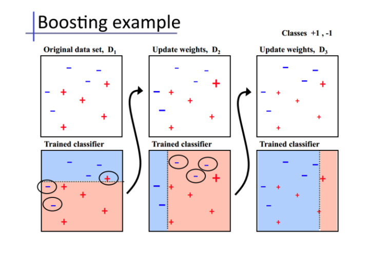
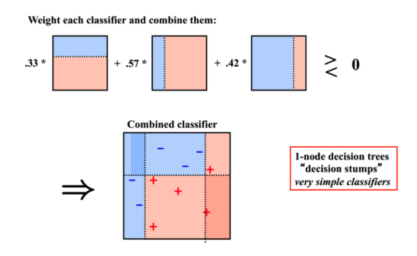

# 模型融合
- 特征工程
- 调参
- 模型融合
## Voting
采取投票制的方法，投票多者确定为最终的分类
## Averaging
进行加权平均。权值可以用排序的方法确定，举个例子，比如A、B、C三种基本模型，模型效果进行排名，假设排名分别是1，2，3，那么给这三个模型赋予的权值分别是3/6、2/6、1/6
这两种方法看似简单，其实后面的高级算法也可以说是基于此而产生的，Bagging或者Boosting都是一种把许多弱分类器这样融合成强分类器的思想
## Bagging（随机森林）并行处理
- 有放回的进行抽样，用抽样的例子建立模型，对模型进行建模
- 重复k次
	- 有放回的重复抽样
	- 训练子模型（基分类器为决策树）
- 模型融合
	- 分类
	- 回归
## Boosting （AdaBoost、GBDT）迭代处理
- 每一次都更加关心分类错误的样本

- 给这些分类错误的样例增加更大的权重

- 下一次就可以更加容易的辨别上一轮出现分类错误的样例





## 随机森林、Adaboost、GBDT、XGBoost的区别是什么？
- Boosting流派，各分类器之间有依赖关系，必须串行，比如Adaboost、GBDT(Gradient Boosting Decision Tree)、Xgboost

- Bagging流派，各分类器之间没有依赖关系，可各自并行，比如随机森林（Random Forest）

- "Adaptive Boosting"（自适应增强）:
	前一个基本分类器分错的样本会得到加强，加权后的全体样本再次被用来训练下一个基本分类器。同时，在每一轮中加入一个新的弱分类器，直到达到某个预定的足够小的错误率或达到预先指定的最大迭代次数。
	
	

## Stacking
```python
def get_oof(clf, x_train, y_train, x_test):
 oof_train = np.zeros((ntrain,))  
 oof_test = np.zeros((ntest,))
 oof_test_skf = np.empty((NFOLDS, ntest))  #NFOLDS行，ntest列的二维array
 for i, (train_index, test_index) in enumerate(kf): #循环NFOLDS次
     x_tr = x_train[train_index]
     y_tr = y_train[train_index]
     x_te = x_train[test_index]
     clf.fit(x_tr, y_tr)
     oof_train[test_index] = clf.predict(x_te)
     oof_test_skf[i, :] = clf.predict(x_test)  #固定行填充，循环一次，填充一行
 oof_test[:] = oof_test_skf.mean(axis=0)  #axis=0,按列求平均，最后保留一行
 return oof_train.reshape(-1, 1), oof_test.reshape(-1, 1)  #转置，从一行变为一列
```

